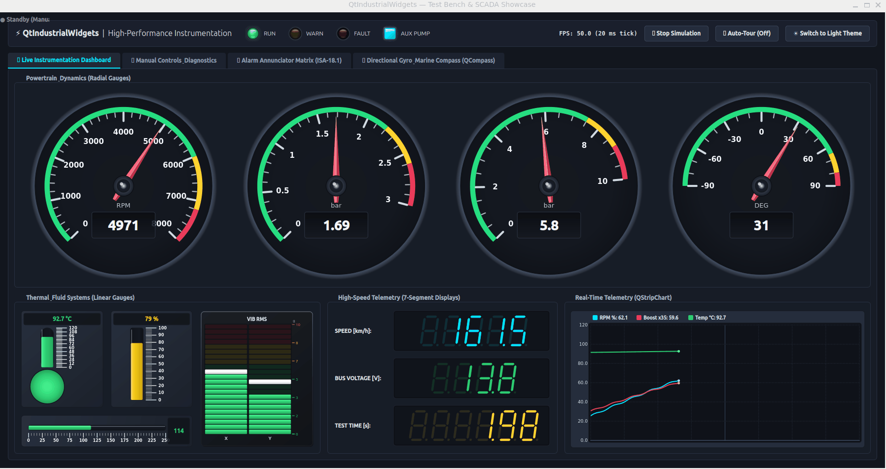

<!--
SPDX-FileCopyrightText: 2026 Paolo Sereno <paolomsereno@gmail.com>

SPDX-License-Identifier: MIT
-->

# QtIndustrialWidgets ⚡

[](https://en.cppreference.com/w/cpp/17)
[](https://www.qt.io/)
[](LICENSE)
[](https://api.reuse.software/info/github.com/paolosereno/QtIndustrialWidgets)
[]()
[](https://github.com/paolosereno/QtIndustrialWidgets/actions/workflows/ci.yml)
[](tests/)
[-brightgreen.svg)](tests/)
[](https://paolosereno.github.io/QtIndustrialWidgets/)

A modern, modular, high-performance C++ / Qt open-source instrumentation library designed specifically for **test benches**, **automotive software**, **SCADA**, **telemetry dashboards**, and **scientific laboratories**.

---

## Enterprise & Supply Chain Security

- **REUSE Compliant**: 100% compliant with the REUSE specification (ISO/IEC 5962:2021) for accurate, machine-readable licensing.
- **Automated SBOM**: An updated Software Bill of Materials (SBOM in SPDX/CycloneDX format) is automatically built and attached as an asset to every official GitHub release.
- **Zero Third-Party Dependencies**: Self-contained library requiring only official Qt modules, eliminating supply-chain attack vectors and external dependency drift.
- **Continuous Quality Assurance**: Multi-platform automated CI/CD pipeline covering Linux, Windows, and macOS with 100% passing test coverage.

---

<p align="center">
  
</p>

---

## 🚀 Key Features

- **Blazing Fast Rendering (60+ FPS)**:
  Static elements (bezels, backgrounds, threshold arc bands, tick marks, numeric labels) are rendered into a cached `QPixmap` on resize or layout changes. During high-frequency updates (e.g. 50+ Hz), only dynamic elements (needles, liquid levels, digital values) are redrawn over the cached background, ensuring minimal CPU utilization.
- **Hi-DPI & 4K Ready**:
  Accurate multi-monitor and Hi-DPI scaling using `devicePixelRatioF()`. No blurry dial faces or fuzzy text on Retina / 4K monitors.
- **Pure Vector 7-Segment Display**:
  Sharp, anti-aliased polygon rendering with customizable italic skew angle, decimal points, and authentic ghost unlit segment transparency.
- **Native Light & Dark Mode / Theming**:
  Paints seamlessly across system light and dark themes using `palette()` and configurable styling properties.
- **Strict Architectural Separation**:
  The core library `QtIndustrialWidgets` depends **only** on `Qt::Core`, `Qt::Gui`, and `Qt::Widgets`. The Qt Designer plugin is isolated in a separate module (`QtIndustrialWidgetsPlugin`), guaranteeing zero unwanted Designer dependencies in production applications.
- **Standard C++17 & Dual Qt 6 / Qt 5.15 Support**:
  Designed for modern C++ standards and compatible with Qt 6.x and Qt 5.15 LTS.

---

## 📦 Widgets Included

### 1. `QRadialGauge`
Circular tachometer, speedometer, and manometer widget.
- **Configurable Sweep Angles**: Supports standard 270° dials, 240° automotive clusters, or 180° semicircular gauges (`startAngle`, `spanAngle`).
- **Graduated Scale**: Major ticks, minor subdivisions, and auto-centered numeric values.
- **Threshold Zones**: Colored arc bands (Normal green, Warning amber, Danger red) with custom thresholds.
- **Vector Needle**: Multi-tone metallic needle with 3D bevel and chrome center pivot hub.
- **Digital Readout**: Integrated recessed display box with configurable precision and measurement units (`km/h`, `bar`, `RPM`, `°C`).

### 2. `QLinearGauge`
Versatile column gauge and thermometer.
- **Dual Orientation**: `Qt::Vertical` and `Qt::Horizontal`.
- **Thermometer & Panel Modes**: Spherical bottom/left bulb mode or rectangular panel bar mode.
- **Dynamic Liquid Styling**: Automatic color shifting based on warning/error thresholds, or continuous linear gradient fill.
- **Reflective Glass Tube**: High-gloss cylindrical reflections with smooth graduated ticks and labels.

### 3. `QSevenSegmentDisplay`
Scalable vector digital display for instrumentation readouts.
- **Vector Polygons**: 100% vector-rendered segments (no pixelated bitmap fonts).
- **Customizable Typography**: Configurable italic tilt angle (`skewAngle`), segment thickness (`segmentWidthRatio`), and leading zeros.
- **Authentic LED/LCD Feel**: Configurable active and inactive segment colors with transparency for realistic ghost segments.
- **Alphanumeric & Decimals**: Supports numbers, minus signs, decimal points, and status codes (`ERR`, `READY`, etc.).

### 4. `QLedIndicator`
Industrial LED panel indicator with 3D lens refraction and blinking.
- **Shapes & Bezels**: Circular or rectangular shapes with machined aluminum/metal bezel ring.
- **Realistic 3D Optics**: Spherical convex lens gradient, specular dome highlights, and soft glow halo.
- **States & Blinking**: Discrete On/Off states with configurable blinking frequency (in milliseconds or Hz) via efficient internal timer.
- **Interactive**: Optional clickable mode with `clicked()` signal for interactive control boards.

### 5. `QIndustrialKnob`
Precision rotary potentiometer and selector switch.
- **Machined CNC Texture**: Lathe-turned aluminum / gunmetal finish with 32-tooth perimeter knurling for realistic tactile appearance.
- **Dual Operating Modes**: Smooth continuous potentiometer for float adjustments or discrete stepped selector switch (e.g. multi-position mode selector).
- **Graduated Scale & Track**: Circular scale with major/minor ticks, aligned numeric values, illuminated active arc track, and bottom digital readout pod.
- **Ergonomic Controls**: Rotary drag, linear drag, mouse wheel fine adjustment, and full keyboard navigation (arrows, PageUp/PageDown, Home/End).

### 6. `QStripChart`
Real-time scrolling telemetry strip chart and oscilloscope.
- **High Performance (60+ FPS)**: Built for high-frequency streaming using preallocated circular ring buffers (`O(1)` amortized point insertion) and Hi-DPI reticle grid background caching.
- **Multi-Channel**: Independent channels with individual trace colors, pen widths, styles, and names.
- **Flexible Axis Scaling**: Manual Y-range or automatic dynamic scaling with margin padding.
- **Oscilloscope Reticle & Legend**: Configurable grid subdivisions, zero-baseline highlighting, live values legend overlay, and real-time numeric readouts.

### 7. `QIndustrialSwitch`
Heavy-duty industrial toggle lever and rocker switch with safety guard.
- **Dual Switch Styles**: Machined metal bat toggle lever or industrial dual-slope rocker switch with illuminated status line.
- **2 & 3 Positions**: Supports standard 2-position (`Off` / `On`) and 3-position (`Manual` / `Off` / `Auto`) operations.
- **Avionics Flip-Up Safety Guard**: Optional iconic red flip-up safety lock cover with warning chevrons and translucent window, preventing accidental actuation.
- **Dual Orientation**: Native support for `Qt::Vertical` and `Qt::Horizontal` mounting.
- **Tactile Feedback & Animation**: Mechanical snap toggle animation with realistic bounce, LED status indicator, 4-corner mounting screws, keyboard navigation, and mouse drag.

### 8. `QLevelMeter`
Multi-channel industrial VU and level meter with peak hold.
- **Multi-Channel & Stereo**: Supports 1, 2 (stereo L/R) or arbitrary N channels with customizable labels.
- **Peak Hold & Decay**: Floating peak indicator line/segment with configurable hold time (in ms) and smooth exponential/linear decay rate.
- **Segmented & Continuous Modes**: Classic discrete rectangular LED block ladder with unlit ghost segment opacity, or smooth gradient fill.
- **Tri-Color Zones**: Configurable Normal (green), Warning (amber) and Error / Overload (red) zones with `overloadOccurred(int)` signal.
- **Dual Orientation & Scale**: Vertical and horizontal mounting with graduated dB or engineering units scale.

### 9. `QAnnunciatorPanel`
Industrial alarm annunciator window matrix conforming to the ANSI/ISA-18.1 standard.
- **Configurable Matrix**: Flexible N x M grid of backlit acrylic indicator tiles with engraved multi-line legends.
- **ANSI/ISA-18.1 Sequences**: Sequence A (Automatic Reset) and Sequence M (Manual Reset) logic handling Normal, Unacknowledged (rapid flash), Acknowledged (steady lit), and Ringback (slow flash) alarm states.
- **Alarm Classification**: Tri-level priority grading: Critical (Red), Warning (Amber), and Advisory (Cyan).
- **Control Station Operations**: Dedicated Acknowledge (ACK), Silence (horn mute), Reset, and Lamp Test functionality with `audibleHornChanged(bool)` horn signal.
- **Interactive Operator Action**: Click directly on individual tiles to acknowledge alarms, with Hi-DPI frame caching for zero-overhead rendering.

### 10. `QCompass`
Marine gyrocompass and aeronautical directional heading indicator instrument.
- **Dual Operating Modes**: `HeadingUp` (rotating compass card matching aircraft/marine heading) and `NorthUp` (fixed compass rose with 360° dual-tone magnetic needle).
- **Course Deviation & Heading Bug**: Adjustable target heading bug with interactive mouse click/drag, displaying real-time angular course deviation (CDI).
- **Navigation Scales**: Full 360° degree markings, cardinal (N, E, S, W) and intercardinal (NE, SE, SW, NW) indices, and aviation 3-digit heading numbers.
- **Lubber Reference & Digital Pod**: Fixed fluorescent lubber line at 12 o'clock and recessed central digital heading angle readout.

---

## 🛠️ Build and Installation

### Prerequisites
- CMake 3.16 or newer
- C++17 compiler (GCC 9+, Clang 10+, MSVC 2019+)
- Qt 6 (6.2+) or Qt 5 (5.15) (`Core`, `Gui`, `Widgets`, and optionally `Designer` / `UiPlugin`)
- Doxygen & Graphviz (optional, for generating HTML API documentation and class diagrams)

### Quick Build (Linux / macOS / Windows)

```bash
# Configure
cmake -B build -DCMAKE_BUILD_TYPE=Release

# Build library, designer plugin, gallery and unit tests
cmake --build build

# Run unit tests (QtTest)
ctest --test-dir build --output-on-failure

# Generate API documentation (requires Doxygen)
cmake --build build --target docs

# Run the interactive gallery showcase
./build/bin/QtIndustrialWidgetsGallery
```

---

## 💻 Integrating into Your CMake Project

### Option A: Via `FetchContent` (Recommended)

Include directly in your `CMakeLists.txt` without installing:

```cmake
include(FetchContent)

FetchContent_Declare(
    QtIndustrialWidgets
    GIT_REPOSITORY https://github.com/paolosereno/QtIndustrialWidgets.git
    GIT_TAG        v1.0.0
)

# Optional: Disable examples and designer plugin when fetching as a dependency
set(BUILD_EXAMPLES OFF CACHE BOOL "" FORCE)
set(BUILD_DESIGNER_PLUGIN OFF CACHE BOOL "" FORCE)

FetchContent_MakeAvailable(QtIndustrialWidgets)

# Link to your application target
target_link_libraries(my_industrial_app
    PRIVATE
        QtIndustrialWidgets::QtIndustrialWidgets
)
```

### Option B: Via `find_package` (Installed Package)

```bash
# Install to system or prefix
cmake --install build --prefix /opt/QtIndustrialWidgets
```

In your application's `CMakeLists.txt`:

```cmake
find_package(QtIndustrialWidgets REQUIRED)

target_link_libraries(my_industrial_app
    PRIVATE
        QtIndustrialWidgets::QtIndustrialWidgets
)
```

### Option C: Via Prebuilt Native Packages (.deb / .zip)

Download official packages from [GitHub Releases](https://github.com/paolosereno/QtIndustrialWidgets/releases):
- **Debian / Ubuntu**: `sudo dpkg -i qtindustrialwidgets_1.0.0_amd64.deb`
- **Windows / Linux**: Extract `.zip` / `.tar.gz` and point `CMAKE_PREFIX_PATH` to the extracted directory.

### Option D: Via C++ Package Managers (vcpkg / Conan)

- **vcpkg**: `vcpkg install --overlay-ports=./ports/qtindustrialwidgets qtindustrialwidgets`
- **Conan 2.0**: `conan install . --build=missing`

---

## 🎨 Qt Designer Integration

When `BUILD_DESIGNER_PLUGIN` is enabled (default when `Qt::Designer` is detected), the plugin target `QtIndustrialWidgetsPlugin` is built.

Install or copy the resulting plugin library into your Qt Designer / Qt Creator plugin directory:
- Linux: `~/.local/share/QtProject/QtCreator/plugins` or `<Qt_Install>/plugins/designer/`
- Windows: `<Qt_Install>/plugins/designer/`

The widgets will automatically appear in the **Industrial Widgets** category in Qt Designer.

---

## 📚 Generating Documentation (Doxygen)

> 🌐 **Online Documentation (GitHub Pages)**: [https://paolosereno.github.io/QtIndustrialWidgets/](https://paolosereno.github.io/QtIndustrialWidgets/)

QtIndustrialWidgets includes extensive Doxygen documentation and markdown integration guides covering all 10 widgets, architecture design, and integration tutorials.

### Prerequisites

To generate the documentation locally:
- **Doxygen** (`1.9+` recommended)
- **Graphviz** (optional, enables inheritance and dependency `.dot` diagrams)

On Debian / Ubuntu:
```bash
sudo apt-get install -y doxygen graphviz
```

On macOS (Homebrew):
```bash
brew install doxygen graphviz
```

On Windows:
Download and install [Doxygen](https://www.doxygen.nl/download.html) and [Graphviz](https://graphviz.org/download/).

### Build Documentation with CMake

When Doxygen is installed, CMake registers the `docs` target automatically (enabled by default via `BUILD_DOCS=ON`):

```bash
# Configure with documentation enabled
cmake -B build -DCMAKE_BUILD_TYPE=Release -DBUILD_DOCS=ON

# Generate HTML documentation
cmake --build build --target docs
```

The generated HTML documentation is placed in:
```text
build/docs/html/index.html
```

### Viewing the Documentation

Open the generated documentation in your default browser:
```bash
xdg-open build/docs/html/index.html    # Linux
open build/docs/html/index.html        # macOS
start build/docs/html/index.html       # Windows
```

Alternatively, you can generate documentation standalone from the project root:
```bash
doxygen docs/Doxyfile
```

### Included Documentation Guides
- **[Getting Started Guide](docs/getting_started.md)**: Setup via CMake `FetchContent`, `find_package`, and standalone integration.
- **[Theming and Styling Guide](docs/theming.md)**: Customizing dial colors, indicator palettes, and dark/light mode integration.
- **[Qt Designer Plugin Guide](docs/designer_plugin.md)**: Compiling and deploying the plugin for Qt Designer and Qt Creator.
- **Full C++ API Reference**: Exhaustive Doxygen docstrings for all classes, properties, slots, and signals.

---

## 📝 Usage Example

```cpp
#include <QtIndustrialWidgets/QRadialGauge.h>
#include <QtIndustrialWidgets/QLinearGauge.h>
#include <QtIndustrialWidgets/QSevenSegmentDisplay.h>

// Create a high-performance RPM gauge
auto *rpmGauge = new QRadialGauge(this);
rpmGauge->setRange(0.0, 8000.0);
rpmGauge->setValue(3500.0);
rpmGauge->setUnit("RPM");
rpmGauge->setWarningThreshold(6000.0);
rpmGauge->setErrorThreshold(7200.0);

// Create a coolant thermometer with bulb
auto *coolant = new QLinearGauge(this);
coolant->setThermometerMode(true);
coolant->setRange(0.0, 120.0);
coolant->setValue(90.0);
coolant->setUnit("°C");

// Create a vector 7-segment digital speedometer
auto *speedometer = new QSevenSegmentDisplay(this);
speedometer->setDigitCount(5);
speedometer->setDecimalPlaces(1);
speedometer->setValue(120.4);
speedometer->setActiveSegmentColor(QColor(0, 229, 255)); // Neon Cyan
```

---

## 📄 License & REUSE Compliance

This project is licensed under the [MIT License](LICENSE) (SPDX: `MIT`) and is 100% compliant with the [REUSE Specification v3.3](https://reuse.software/) and [SPDX](https://spdx.dev/) standards.

- Full license text: [`LICENSES/MIT.txt`](LICENSES/MIT.txt)
- Machine-readable copyright & license headers on all project files.
- REUSE status: [](https://api.reuse.software/info/github.com/paolosereno/QtIndustrialWidgets)

