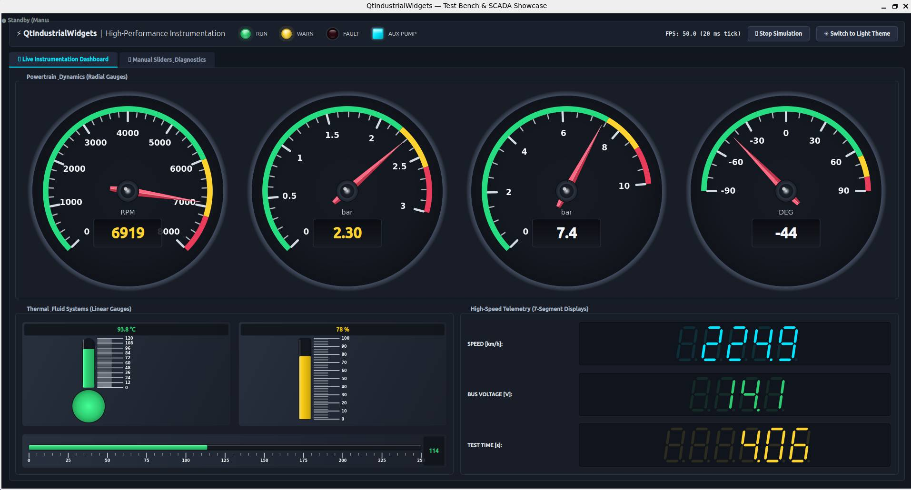

# QtIndustrialWidgets ⚡

[](https://en.cppreference.com/w/cpp/17)
[](https://www.qt.io/)
[](LICENSE)
[]()

A modern, modular, high-performance C++ / Qt open-source instrumentation library designed specifically for **test benches**, **automotive software**, **SCADA**, **telemetry dashboards**, and **scientific laboratories**.

---

<p align="center">
  
</p>

---

## 🚀 Key Features

- **Blazing Fast Rendering (60+ FPS)**:
  Static elements (bezels, backgrounds, threshold arc bands, tick marks, numeric labels) are rendered into a cached `QPixmap` on resize or layout changes. During high-frequency updates (e.g. 50+ Hz), only dynamic elements (needles, liquid levels, digital values) are redrawn over the cached background, ensuring minimal CPU utilization.
- **Hi-DPI & 4K Ready**:
  Accurate multi-monitor and Hi-DPI scaling using `devicePixelRatioF()`. No blurry dial faces or fuzzy text on Retina / 4K monitors.
- **Pure Vector 7-Segment Display**:
  Sharp, anti-aliased polygon rendering with customizable italic skew angle, decimal points, and authentic ghost unlit segment transparency.
- **Native Light & Dark Mode / Theming**:
  Paints seamlessly across system light and dark themes using `palette()` and configurable styling properties.
- **Strict Architectural Separation**:
  The core library `QtIndustrialWidgets` depends **only** on `Qt::Core`, `Qt::Gui`, and `Qt::Widgets`. The Qt Designer plugin is isolated in a separate module (`QtIndustrialWidgetsPlugin`), guaranteeing zero unwanted Designer dependencies in production applications.
- **Standard C++17 & Dual Qt 6 / Qt 5.15 Support**:
  Designed for modern C++ standards and compatible with Qt 6.x and Qt 5.15 LTS.

---

## 📦 Widgets Included

### 1. `QRadialGauge`
Circular tachometer, speedometer, and manometer widget.
- **Configurable Sweep Angles**: Supports standard 270° dials, 240° automotive clusters, or 180° semicircular gauges (`startAngle`, `spanAngle`).
- **Graduated Scale**: Major ticks, minor subdivisions, and auto-centered numeric values.
- **Threshold Zones**: Colored arc bands (Normal green, Warning amber, Danger red) with custom thresholds.
- **Vector Needle**: Multi-tone metallic needle with 3D bevel and chrome center pivot hub.
- **Digital Readout**: Integrated recessed display box with configurable precision and measurement units (`km/h`, `bar`, `RPM`, `°C`).

### 2. `QLinearGauge`
Versatile column gauge and thermometer.
- **Dual Orientation**: `Qt::Vertical` and `Qt::Horizontal`.
- **Thermometer & Panel Modes**: Spherical bottom/left bulb mode or rectangular panel bar mode.
- **Dynamic Liquid Styling**: Automatic color shifting based on warning/error thresholds, or continuous linear gradient fill.
- **Reflective Glass Tube**: High-gloss cylindrical reflections with smooth graduated ticks and labels.

### 3. `QSevenSegmentDisplay`
Scalable vector digital display for instrumentation readouts.
- **Vector Polygons**: 100% vector-rendered segments (no pixelated bitmap fonts).
- **Customizable Typography**: Configurable italic tilt angle (`skewAngle`), segment thickness (`segmentWidthRatio`), and leading zeros.
- **Authentic LED/LCD Feel**: Configurable active and inactive segment colors with transparency for realistic ghost segments.
- **Alphanumeric & Decimals**: Supports numbers, minus signs, decimal points, and status codes (`ERR`, `READY`, etc.).

### 4. `QLedIndicator`
Industrial LED panel indicator with 3D lens refraction and blinking.
- **Shapes & Bezels**: Circular or rectangular shapes with machined aluminum/metal bezel ring.
- **Realistic 3D Optics**: Spherical convex lens gradient, specular dome highlights, and soft glow halo.
- **States & Blinking**: Discrete On/Off states with configurable blinking frequency (in milliseconds or Hz) via efficient internal timer.
- **Interactive**: Optional clickable mode with `clicked()` signal for interactive control boards.

### 5. `QIndustrialKnob`
Precision rotary potentiometer and selector switch.
- **Machined CNC Texture**: Lathe-turned aluminum / gunmetal finish with 32-tooth perimeter knurling for realistic tactile appearance.
- **Dual Operating Modes**: Smooth continuous potentiometer for float adjustments or discrete stepped selector switch (e.g. multi-position mode selector).
- **Graduated Scale & Track**: Circular scale with major/minor ticks, aligned numeric values, illuminated active arc track, and bottom digital readout pod.
- **Ergonomic Controls**: Rotary drag, linear drag, mouse wheel fine adjustment, and full keyboard navigation (arrows, PageUp/PageDown, Home/End).

---

## 🛠️ Build and Installation

### Prerequisites
- CMake 3.16 or newer
- C++17 compiler (GCC 9+, Clang 10+, MSVC 2019+)
- Qt 6 (6.2+) or Qt 5 (5.15) (`Core`, `Gui`, `Widgets`, and optionally `Designer` / `UiPlugin`)

### Quick Build (Linux / macOS / Windows)

```bash
# Configure
cmake -B build -DCMAKE_BUILD_TYPE=Release

# Build library, designer plugin and gallery
cmake --build build

# Run the interactive gallery showcase
./build/examples/gallery/QtIndustrialWidgetsGallery
```

---

## 💻 Integrating into Your CMake Project

### Option A: Via `FetchContent` (Recommended)

Include directly in your `CMakeLists.txt` without installing:

```cmake
include(FetchContent)

FetchContent_Declare(
    QtIndustrialWidgets
    GIT_REPOSITORY https://github.com/paolo/QtIndustrialWidgets.git
    GIT_TAG        v1.0.0
)

# Optional: Disable examples and designer plugin when fetching as a dependency
set(BUILD_EXAMPLES OFF CACHE BOOL "" FORCE)
set(BUILD_DESIGNER_PLUGIN OFF CACHE BOOL "" FORCE)

FetchContent_MakeAvailable(QtIndustrialWidgets)

# Link to your application target
target_link_libraries(my_industrial_app
    PRIVATE
        QtIndustrialWidgets::QtIndustrialWidgets
)
```

### Option B: Via `find_package` (Installed Package)

```bash
# Install to system or prefix
cmake --install build --prefix /opt/QtIndustrialWidgets
```

In your application's `CMakeLists.txt`:

```cmake
find_package(QtIndustrialWidgets REQUIRED)

target_link_libraries(my_industrial_app
    PRIVATE
        QtIndustrialWidgets::QtIndustrialWidgets
)
```

---

## 🎨 Qt Designer Integration

When `BUILD_DESIGNER_PLUGIN` is enabled (default when `Qt::Designer` is detected), the plugin target `QtIndustrialWidgetsPlugin` is built.

Install or copy the resulting plugin library into your Qt Designer / Qt Creator plugin directory:
- Linux: `~/.local/share/QtProject/QtCreator/plugins` or `<Qt_Install>/plugins/designer/`
- Windows: `<Qt_Install>/plugins/designer/`

The widgets will automatically appear in the **Industrial Widgets** category in Qt Designer.

---

## 📝 Usage Example

```cpp
#include <QtIndustrialWidgets/QRadialGauge.h>
#include <QtIndustrialWidgets/QLinearGauge.h>
#include <QtIndustrialWidgets/QSevenSegmentDisplay.h>

// Create a high-performance RPM gauge
auto *rpmGauge = new QRadialGauge(this);
rpmGauge->setRange(0.0, 8000.0);
rpmGauge->setValue(3500.0);
rpmGauge->setUnit("RPM");
rpmGauge->setWarningThreshold(6000.0);
rpmGauge->setErrorThreshold(7200.0);

// Create a coolant thermometer with bulb
auto *coolant = new QLinearGauge(this);
coolant->setThermometerMode(true);
coolant->setRange(0.0, 120.0);
coolant->setValue(90.0);
coolant->setUnit("°C");

// Create a vector 7-segment digital speedometer
auto *speedometer = new QSevenSegmentDisplay(this);
speedometer->setDigitCount(5);
speedometer->setDecimalPlaces(1);
speedometer->setValue(120.4);
speedometer->setActiveSegmentColor(QColor(0, 229, 255)); // Neon Cyan
```

---

## 📄 License

This project is licensed under the [MIT License](LICENSE).
